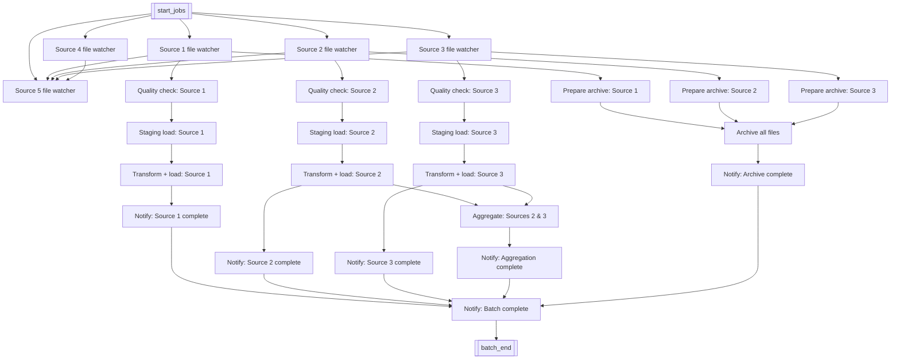

# airflow-demo

A working Apache Airflow demo used for customer presentations, showing a typical enterprise batch/data-warehouse orchestration pattern: multiple source feeds landing, quality-checking, staging, transforming, aggregating, archiving, and notifying — all as a single DAG.

## Architecture



**Task groups**

| Stage | What it represents | Tasks |
|---|---|---|
| Kickoff | Signals the batch has started | `start_jobs` |
| Ingestion | Watches for arrival of each source file | `Source_{1-5}_file_watcher` |
| Quality | Validates an arrived source file before it's trusted downstream | `quality_checks_on_source_{1-3}_file` |
| Staging | Loads the validated file into a staging area | `staging_load_for_source_{1-3}` |
| Transform | Applies business transformations and loads to the core/final layer | `transformations_and_load_for_source_{1-3}` |
| Aggregation | Combines sources 2 and 3 downstream of their transforms | `Aggregation_for_sources_2_and_3` |
| Archival | Prepares and moves processed files to archive storage | `prepare_for_archive_source_{1-3}_file`, `archive_all_files` |
| Notification | Emails/alerts on completion of each sub-flow and the overall batch | `mail_load_completion_for_source_{1-3}`, `mail_load_completion_for_agg`, `mail_archive_completion`, `mail_batch_completion` |
| Close | Marks the batch as finished | `batch_end` |

## Design notes

- Sources 1–3 run the full ingest → quality → stage → transform → notify chain and also feed the archive path. Sources 4 and 5 are included as file watchers only (to show fan-out/fan-in with a variable number of upstream feeds) and are not carried through quality/staging/transform — this is intentional for the demo, not an oversight, and would be extended symmetrically in a production build.
- Every task uses `BashOperator` with `echo` placeholders standing in for real work (a quality-check script, a load job, a mailer call, etc.). The DAG's purpose is to demonstrate dependency wiring, fan-out/fan-in, and multi-branch convergence — not to run real ETL logic.
- Retries are configured on the file-watcher tasks (`retries=3`) to simulate tolerance for late-arriving source files; other tasks rely on the DAG-level default (`retries=1`).

## Tech stack

- Apache Airflow, packaged on the [`puckel/docker-airflow`](https://hub.docker.com/r/puckel/docker-airflow) base image
- Docker / Docker Compose for local orchestration
- Bash provisioning script for a plain EC2/Linux host (`scripts/shell/bootstrap_airflow.sh`)

> Note: `puckel/docker-airflow` is a long-unmaintained community image pinned to Airflow 1.x. It's kept here as-is to match the original demo environment; a from-scratch rebuild would start from the official `apache/airflow:2.x` image and the TaskFlow API instead of `BashOperator`.

## Running it

**Locally with Docker Compose**

```bash
cd version1.0
docker-compose up --build
```

The Airflow webserver comes up on [http://localhost:8080](http://localhost:8080).

**On a plain EC2/Linux host**

```bash
bash scripts/shell/bootstrap_airflow.sh
```

This installs Docker, pulls the prebuilt `viswamohanty/airflow-demo` image, and runs it with port 8080 exposed.

## Repo structure

```
version1.0/
├── Dockerfile                       # Builds the demo image on top of puckel/docker-airflow
├── docker-compose.yml                # Local run configuration
├── .env                               # Compose environment variables
└── scripts/
    ├── python/
    │   └── demo-sample-dag.py        # The DAG shown above
    └── shell/
        └── bootstrap_airflow.sh      # EC2/Linux provisioning script
```
